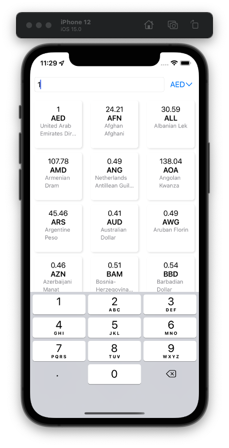
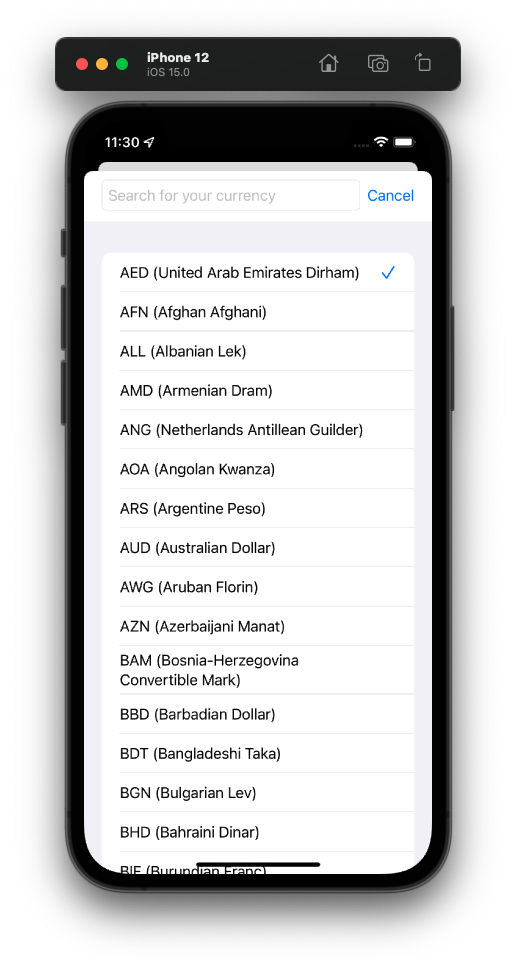
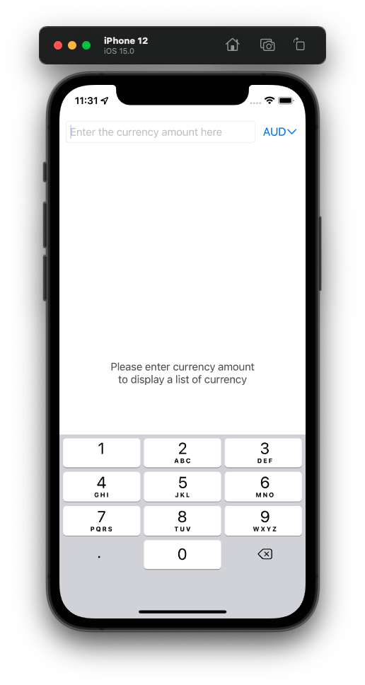
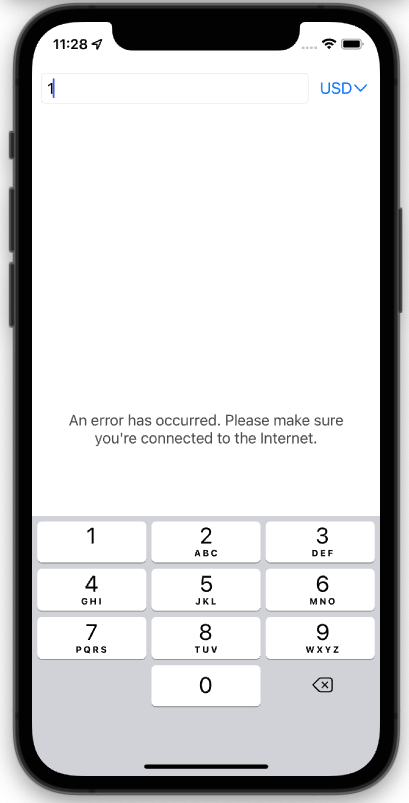

# Purpose of this document
To provide the overview on how to run the code, and to explain the architecture with the motivation behind, such the readers could understand

# Developer's Build environment
- xcode 13.1, macOS Monterey 12.6.1, Intel Mac
- Deployment target: iOS 15
- Testing Device: iPhone12 (iOS 15.0)
- build target for the app: `currency-conversion`

# Architecture
### UI Library: Hybrid of SwiftUI & UIKit
- more precisely speaking, SwiftUI in UIKit
- Motivation
  - Demonstrate the ability to write codes in both SwiftUI and UIKit, which are common in most modern app development environment
  - Technique of wrapping SwiftUI components in UIKit is useful for
    - as a process of migrating exisiting UIKit's code to SwiftUI, which cannot be done all at once
    - avoiding specific SwiftUI's bugs

### MVVM Architecture
- MVVM stands for Model-View-ViewModel
  - `ViewModel`: Responsible for handling the business logic to generate data for UI. Independent of the actual ui operation required to update the view.
  - `ViewController`: Responsible for the actual operation required to update the UI. Independent of the business logic to generate data for Home's UI.
- Motivation:
  - Achieve the seperation fo concern between UI and Business logic
  - Increase the testability of the program, as codes involving UI's operation are difficult to test
  - Increase the readibility of the program, as codes can be written in a more "reactive" and "functional" manner

### Directory Structure of `currency-conversion`
1. UI Layer (`Views`)
2. Presentation Layer (`ViewModel`)
3. Domain (`UseCaes`)
4. Data Layer (`API`, `UserDefaults`)

### Multimodule
- `Core` is seperated as a dynamic framework from `currency-conversion`
  - `Core`: A common module, independent of business logic or specific requirement. Contains a number of extensions of UIKit's ViewController, or utility functions.
  - `currency-conversion`: The main target for building the app, containg business logic
  Note: A possible way to further seperate `currency-conversion` is to convert different `/Feature` in sepearted libraries, which would highly speed up the build process during actual development, since we seldom work on all the features at the same time.
- Motivation
  - avoid implicit dependency from `Core` to `currency-conversion`, such that a seperation of concerned can be imposed with better confidence
  - increase build speed, as codes on `Core` are changed much less often than that in `currency-conversion`, such that `Core` is not required to be rebuilt everytime

# Quality
Code is guaranteed functioning correctly using the following test codes:

- logics on `currency-conversion` are tested by the target `currency-conversionTests`
- logics on `Core` are tested by the target `CoreTests`

I believe an effective test code should not only aim for coverage and testing the accuracy of functions, but it should be written in a way the different scenarios of of using the app can be well expressed, with expected results from requirement. For example, I have written scenarios including "first time to display the home view" (`test_viewWillAppear()`), "user entering an amount" (`test_didUpdateAmount()`), or "update selected amount, but with error" (`test_didUpdateSelectedAmount_error_on_getCurrenciesUseCase()`), etc. This is done by architecturing the code with seperation of concern and a number of data mocking techniques. It is recommended to take a look at the test files to understand the edge cases that have been taken care of in this app.

# Remarks

### Additional assumption on requirement
- In offline mode, users can reuse persistent data even cache expires (>30 minutes)
- In currency selection modal, users can type keywords for searching the desired currency
(more assumption on multiple edge cases can be found in the test cases written)

### Further Improvement (which i considered out of scope)
(Not implemented due to time limitation)
- (code) API Keys should be kept secret and ignored from pushing to code sources. A way to achieve this is to create a sepearte file, which is listed on `.gitignore`
- (code) writting even more patterns of `struct CurrencyListItemView_Previews: PreviewProvider`, so that the correctness of UI can also be guaranteed for more patterns.
- (requirement) It would be considerable to provide a way for user to filter the calculation result of currencies.
- (requirement) Upper limit on currency amount input, to avoid number overflow
- (requirement) When the amount is large enough, the number might not be fully displayed in the currency list well. As an improvement, 1k = 1000 or 1M = 1,000,000 can be used.
- (requirement) Provide a way to remove the leading zeros in the textfields input.
- (requirement) Presence of keyboard might not be welcome in some cases, so it would be better to provide better ways to dismiss the keyboard

### Some Screenshots for references
  
  
  
  
